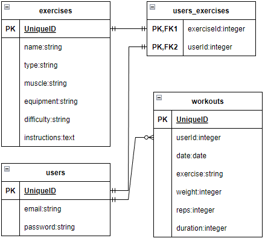
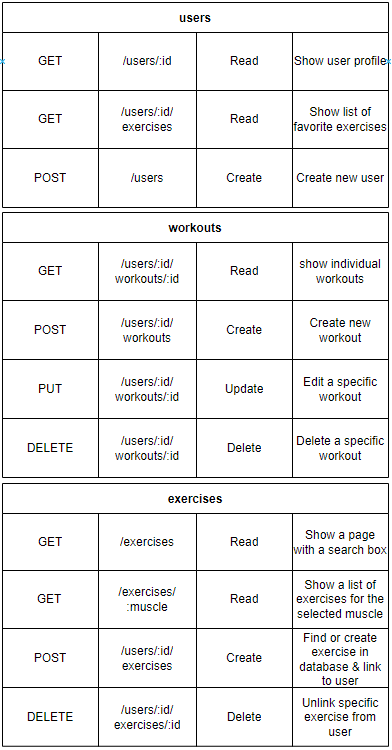
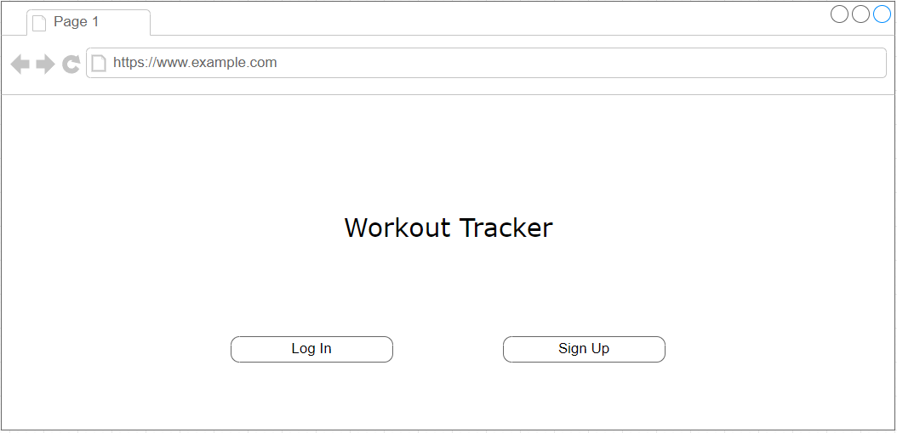
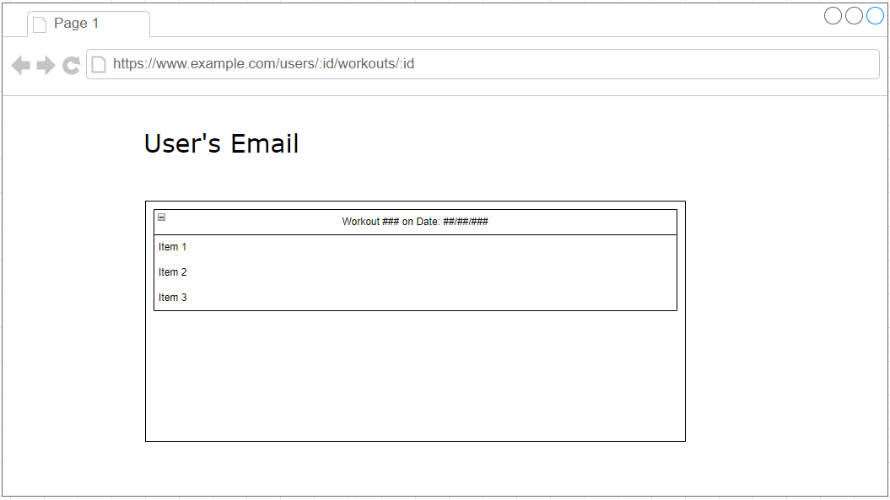
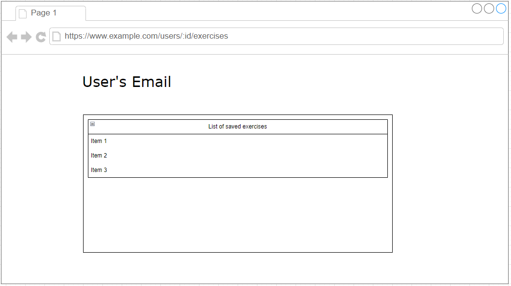
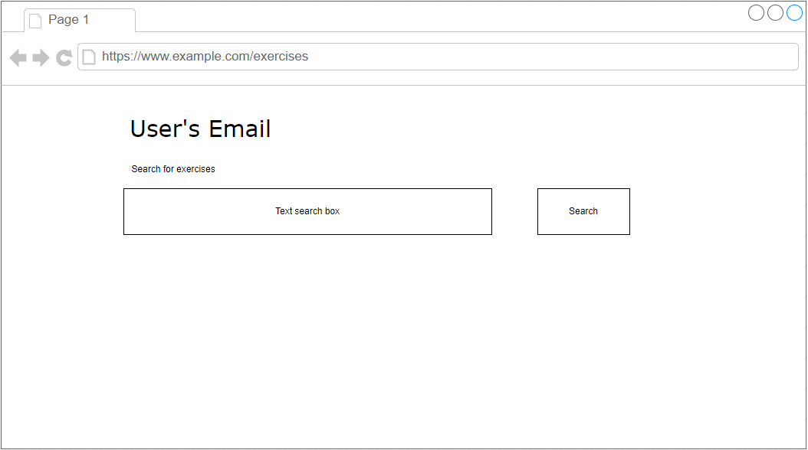
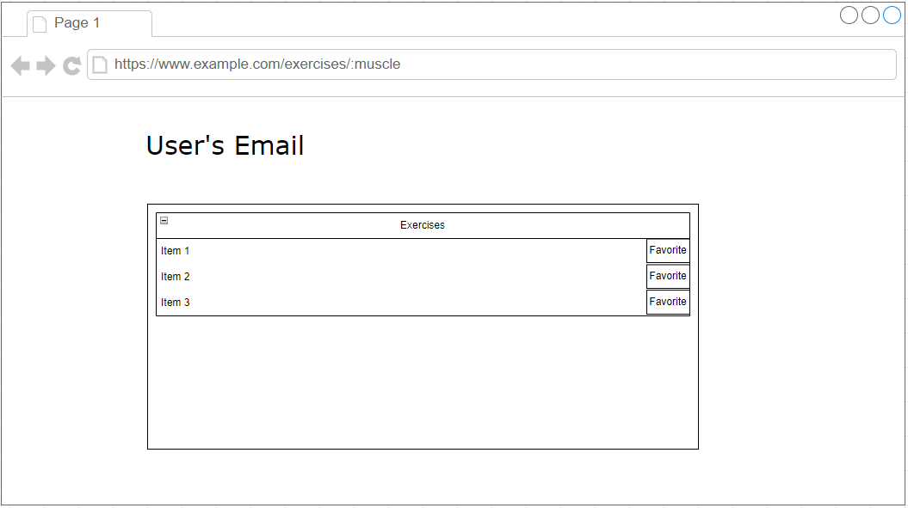

# Project Pitch

## Description
A workout tracking app that will allow a user to track their workouts over time and save workouts into a database to be viewed later. There will be an additional functionality to search for some example workouts based on muscle that provides instructions on the exercise.

## API
I'll be using this API https://api-ninjas.com/api/exercises

example implementation:
const url = 'https://api.api-ninjas.com/v1/exercises?muscle=biceps'
const config = { headers: { X-Api-Key: API_KEY }}

axios.get(url, config)

## ERDs

## Restful Routing Chart

## Wireframes

## User Stories
- As a user, I want to save information about my workouts.
- As a user, I want to view all of my previous workouts.
- As a user, I want to view each of my previous workouts individually.
- As a user, I want to search for example exercises with instructions included.
- As a user, I want to save save a list of my favorite exercises.

## MVP Goals
- System for creating and signing into accounts with secure authentication.
- User profile page with a list of 20 most recent workouts.
- Exercise search page where a user can search for example exercises based on the muscle they'd like to target and see multiple results with instructions for use.
- Connected Postgresql database with a table storing user information and a table for storing workout information with a 1:M relationship from users:workouts. Additionally, a table for storing exercises that have been favorited which will have a N:M relationship with users and include a join table.

## Stretch Goals
- Workout templates
- Ability to link exercises to certain workout templates so they can be read while filling out the template.
- Some form of data analytics related to each template showing the weight used over time.