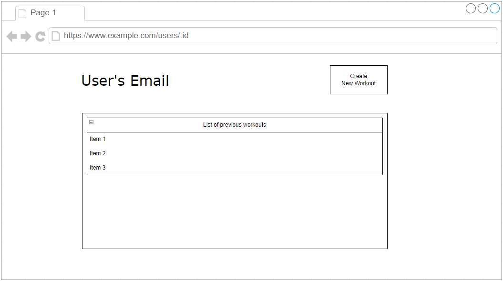

# Project Pitch

## Description
A workout tracking app that will allow a user to track their workouts over time and save workouts into a database to be viewed later. There will be an additional functionality to search for some example workouts based on muscle that provides instructions on the exercise.

Link to deployed site: https://t-workout-tracker.herokuapp.com/

## Installation Instructions
- Fork and Clone repo to your local repository
- Run 'npm init -y' to initialize npm
- Run 'npm install' or 'npm i' in the terminal to download of all required npm packages. node_modules should appear in the folder.
- Make sure node_modules and .env are in the gitignore file before committing to remote repository
- Create a .env file and add a SECRET key, ex -- "SECRET='example secret'" as well as an API_KEY, which you'll need to grab from https://api-ninjas.com after creating an account.
- Check the config.json file under the config folder to make sure that the database config is set up appropriately for your system
- Run 'sequelize db:create' to create the database in psql
- Run 'sequelize db:migrate' to migrate the models
- Use 'npx nodemon' (or just 'nodemon' if you installed it globally) to start your application
- Go to http://localhost:8000/ in any browser to view the application

## Technologies Used
- HTML/CSS/JavaScript
- Express.js
- Sequelize
- Node.js
- Postgresql
- Bcrypt
- Dotenv
- Axios

## Approach Taken
My development process typically starts with small steps and builds out incrementally from each step to create the whole application. In this instance, I started with initially creating a form on the profile page that would enter a workout into the database. From there, I rendered all workouts from the database underneath the form on the profile page. After that was set up, I moved to a separate page that would handle the API requests to get descriptions of exercises and rendered them on a page, then added buttons that would save the exercise to the database and make a link to the user's profile to save it as a favorite, as well as adding some logic to conditionally change the button if the exercise was already added as a favorite. Now that I had favorites being added using a join table, I went back to the profile page and set up a space next to the initial form to show any favorites that have been saved, as well as adding functionality to the list of saved workouts to enable the user to edit any of the previous workouts if they need to change any of the values or the date.

## API
I'll be using this API https://api-ninjas.com/api/exercises

example implementation:
const url = 'https://api.api-ninjas.com/v1/exercises?muscle=biceps'
const config = { headers: { X-Api-Key: API_KEY }}

axios.get(url, config)

## ERDs

## Restful Routing Chart

## Wireframes

## User Stories
- As a user, I want to save information about my workouts.
- As a user, I want to view all of my previous workouts.
- As a user, I want to view each of my previous workouts individually.
- As a user, I want to search for example exercises with instructions included.
- As a user, I want to save a list of my favorite exercises.

## MVP Goals
- System for creating and signing into accounts with secure authentication.
- User profile page with a list of 20 most recent workouts.
- Exercise search page where a user can search for example exercises based on the muscle they'd like to target and see multiple results with instructions for use.
- Connected Postgresql database with a table storing user information and a table for storing workout information with a 1:M relationship from users:workouts. Additionally, a table for storing exercises that have been favorited which will have a N:M relationship with users and include a join table.

## Stretch Goals
- Workout templates
- Ability to link exercises to certain workout templates so they can be read while filling out the template.
- Some form of data analytics related to each template showing the weight used over time.
- Implement Webauthn as an authentication method https://webauthn.guide/#about-webauthn
- Sanitize all database inputs